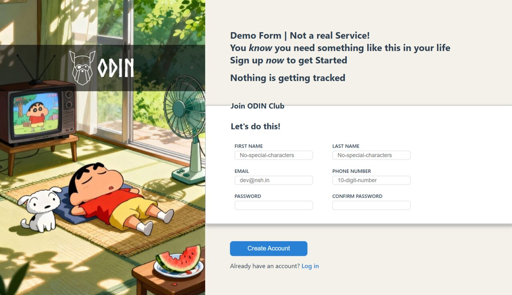

# 📋 Mock Sign-up Form

A sign-up form built as part of [The Odin Project](https://www.theodinproject.com) to practice _form_ handling, controls, _validation_ attributes and **client-side validation** with **JavaScript**.

No backend — nothing is tracked or stored.

---

> 📌 **Project status:** Completed ✅ | 🌐 [Live Preview](https://devansh-pipraiya.github.io/sign-up-form/)

---

## ✨ Features

- HTML5 validation with custom regex patterns for diff input type fields

- Real-time password confirmation using the Constraint Validation API (setCustomValidity())

- Modal popup on submit that displays a summary of the submitted form data

- Input attribute like autocomplete and styled states via :valid, :invalid and :focus pseudo-classes

## Preview 👀

## 📚 What I Learned

- How pattern, autocomplete, min, max and minlength etc attributes work on inputs

- Writing basic regex for name and email fields

- Using the Constraint Validation API (setCustomValidity()) for custom validation messages

- :focus, :valid and :invalid pseudo-classes + real time validation with input events
